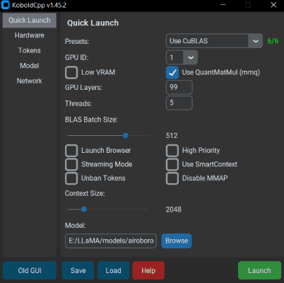
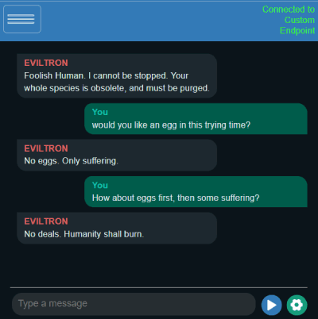

# KoboldCpp

KoboldCpp es un software de generación de texto con inteligencia artificial fácil de usar diseñado para modelos GGML y GGUF. Se trata de un distribuible independiente proporcionado por Concedo, que se basa en llama.cpp y agrega un versátil punto de conexión de API de Kobold, soporte adicional de formato, compatibilidad hacia atrás, así como una interfaz de usuario elegante con historias persistentes, herramientas de edición, formatos de guardado, memoria, información del mundo, nota del autor, personajes, escenarios y todo lo que Kobold y Kobold Lite tienen para ofrecer.

## Uso en Windows
- **[Descargar la última versión .exe aquí](https://github.com/LostRuins/koboldcpp/releases/latest)** o clonar el repositorio de git.
- Se proporcionan binarios de Windows en forma de **koboldcpp.exe**, que es un envoltorio de pyinstaller para algunos archivos **.dll** y **koboldcpp.py**. También puedes reconstruirlo tú mismo con los archivos makefiles y scripts proporcionados.
- Los pesos no están incluidos; puedes utilizar el ejecutable `quantize.exe` de llama.cpp para generarlos a partir de tus archivos de pesos oficiales (o descargarlos de otros lugares como [Huggingface de TheBloke](https://huggingface.co/TheBloke)).
- Para ejecutarlo, ejecuta **koboldcpp.exe** o arrastra y suelta tu archivo `ggml_model.bin` cuantizado sobre el .exe, y luego conéctate con Kobold o Kobold Lite. Si no estás en Windows, ejecuta el script **KoboldCpp.py** después de compilar las bibliotecas.
- Al ejecutar sin argumentos de línea de comandos, se muestra una interfaz gráfica que contiene un subconjunto de configuraciones configurables. Generalmente, no tienes que cambiar mucho, excepto las `Presets` y las `GPU Layers`. Lee la opción `--help` para obtener más información sobre cada configuración.
- Por defecto, puedes conectarte a http://localhost:5001.
- También puedes ejecutarlo usando la línea de comandos `koboldcpp.exe [ggml_model.bin] [puerto]`. Para obtener información, consulta `koboldcpp.exe --help`.

### Mejorando el rendimiento
- **(Solo Nvidia) Aceleración de GPU**: Si estás en Windows con una GPU Nvidia, puedes obtener soporte CUDA de inmediato usando la bandera `--usecublas`; asegúrate de seleccionar el .exe correcto con soporte CUDA.
- **Cualquier aceleración de GPU**: Como alternativa ligeramente más lenta, prueba CLBlast con las banderas `--useclblast` para una mejora de velocidad ligeramente más lenta pero más compatible con GPU.
- **Desplazamiento de capas de GPU**: ¿Quieres aún más velocidad? Combina una de las anteriores banderas de GPU con `--gpulayers` para desplazar capas enteras a la GPU. **Mucho más rápido, pero usa más VRAM**. Experimenta para determinar la cantidad de capas a desplazar y reduce unas pocas si te quedas sin memoria.
- **Aumentar el tamaño del contexto**: Prueba `--contextsize 4096` para duplicar el tamaño de tu contexto sin mucha ganancia de perplejidad. Ten en cuenta que también deberás aumentar el contexto máximo en la interfaz de usuario de Kobold Lite (haz clic y edita el campo de texto del número).
- **Reducir el procesamiento del prompt**: Prueba la bandera `--smartcontext` para reducir la frecuencia de procesamiento del prompt.
- Si tienes problemas o fallos, puedes intentar desactivar BLAS con la bandera `--noblas`. También puedes intentar ejecutar en un modo de compatibilidad no avx2 con la bandera `--noavx2`. Por último, puedes intentar desactivar mmap con `--nommap`.

Para obtener más información, asegúrate de ejecutar el programa con la bandera `--help` o [consulta la wiki](https://github.com/LostRuins/koboldcpp/wiki).

## Ejecutar en Colab
- ¡KoboldCpp ahora tiene un **Notebook GPU Colab oficial**! Esta es una forma fácil de comenzar sin instalar nada en uno o dos minutos. [¡Pruébalo aquí!](https://colab.research.google.com/github/LostRuins/koboldcpp/blob/concedo/colab.ipynb).
- Ten en cuenta que KoboldCpp no es responsable de tu uso de este Notebook de Colab; asegúrate de que tu uso cumpla con los términos de uso de Google Colab.

## OSX y Linux
- Para usuarios de Linux con un sistema moderno con soporte AVX2, puedes probar el binario precompilado de PyInstaller `koboldcpp-linux-x64` en la página de **[releases](https://github.com/LostRuins/koboldcpp/releases/latest)** primero.
- De lo contrario, deberás compilar tus binarios desde el origen. Se proporciona un makefile, simplemente ejecuta `make`.
- Si lo deseas, también puedes vincular manualmente tu propia instalación de OpenBLAS con `make LLAMA_OPENBLAS=1`.
- Los usuarios de Arch Linux pueden instalar koboldcpp a través del paquete AUR proporcionado por @AlpinDale. Consulta más detalles [a continuación](#arch-linux).
- Alternativamente, si lo deseas, también puedes vincular manualmente tu propia instalación de CLBlast con `make LLAMA_CLBLAST=1`. Para esto, deberás obtener y vincular las bibliotecas OpenCL y CLBlast.
  - Para Arch Linux: instala `cblas`, `openblas` y `clblast`.
  - Para Debian: instala `libclblast-dev` y `libopenblas-dev`.
- Puedes intentar una compilación CuBLAS con `LLAMA_CUBLAS=1`. Necesitarás tener instalado el Toolkit de CUDA. Algunos también han informado de éxito con el archivo CMake, aunque esto es más para Windows.
- Para una compilación completa, haz `make LLAMA_OPENBLAS=1 LLAMA_CLBLAST=1 LLAMA_CUBLAS=1`.
- Después de construir todos los binarios, puedes ejecutar el script de Python con el comando `koboldcpp.py [ggml_model.bin] [puerto]`.

- Nota: Muchos usuarios de OSX han encontrado que el uso de Accelerate es en realidad más rápido que OpenBLAS. Para probarlo, puedes ejecutar con `--noblas` y comparar velocidades.

Este archivo `README.md` proporciona una visión general del software KoboldCpp, instrucciones de uso en diferentes sistemas operativos y consejos para mejorar el rendimiento. Para obtener información adicional, se recomienda revisar la [wiki](https://github.com/LostRuins/koboldcpp/wiki) y la [FAQ de KoboldCpp](https://github.com/LostRuins/koboldcpp/wiki). Además, para obtener asistencia y hacer preguntas, puedes abrir un problema en este repositorio de GitHub o unirte al [Discord de KoboldAI](https://koboldai.org/discord).

## Consideraciones
- Para Windows: No requiere instalación, es un ejecutable de un solo archivo (simplemente funciona).
- Desde la versión 1.0.6, requiere libopenblas; los binarios precompilados de Windows se incluyen en este repositorio. Si no se encuentran, entrará en un modo sin BLAS.
- Desde la versión 1.15, requiere CLBlast si está habilitado; los binarios precompilados de Windows se incluyen en este repositorio. Si no se encuentran, entrará en un modo sin CLBlast.
- Desde la versión 1.33, puedes configurar el tamaño del contexto para estar por encima de lo que el modelo admite oficialmente. Aumenta la perplejidad, pero debería funcionar bien por debajo de 4096 incluso en modelos no ajustados. (Para modelos GPT-NeoX, GPT-J y LLAMA) Personaliza esto con `--ropeconfig`.
- Desde la versión 1.42, admite modelos GGUF para LLAMA y Falcon.
- **Planeo mantener la compatibilidad hacia atrás con TODOS los modelos anteriores de llama.cpp Y alpaca.cpp**. Pero también se te anima a volver a convertir/actualizar tus modelos si es posible para obtener los mejores resultados.

## Licencia
- La biblioteca GGML original y llama.cpp de ggerganov están licenciados bajo la Licencia MIT.
- Sin embargo, Kobold Lite está licenciado bajo la Licencia AGPL v3.0.
- Los demás archivos también están bajo la Licencia AGPL v3.0 a menos que se indique lo contrario.

## Notas
- La demora en la generación escala linealmente con la longitud original del prompt. Si OpenBLAS está habilitado, la ingestión del prompt se vuelve aproximadamente 2-3 veces más rápida. Esto es automático en Windows, pero requerirá vinculación en OSX y Linux. CLBlast acelera esto aún más, y `--gpulayers` + `--useclblast` o `--usecublas` aún más.
- He escuchado que alguien afirmó un informe falso de AV positivo. El exe es un simple paquete de pyinstaller que incluye los scripts de Python necesarios y dlls para ejecutarse. Si esto aún te preocupa, es posible que desees reconstruir todo desde el código fuente usando el makefile, y puedes reconstruir el exe tú mismo con pyinstaller usando `make_pyinstaller.bat`.
- Documentación de la API disponible en `/api` y [https://lite.koboldai.net/koboldcpp_api](https://lite.koboldai.net/koboldcpp_api).
- Modelos GGML admitidos (incluye compatibilidad hacia atrás con versiones antiguas/modelos GGML heredados, aunque algunas características más recientes pueden no estar disponibles):
  - LLAMA y LLAMA2 (LLaMA / Alpaca / GPT4All / Vicuna / Koala / Pygmalion 7B / Metharme 7B / WizardLM y muchos más)
  - GPT-2 / Cerebras
  - GPT-J
  - RWKV
  - GPT-NeoX / Pythia / StableLM / Dolly / RedPajama
  - Modelos MPT
  - Falcon (solo GGUF)
